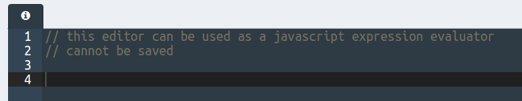

# Minium Core and Minium Developer (javacript editor)

In this training, we'll take a look into Minium Core, and we'll use
Minium Developer to write some Minium javascript code. We'll learn its concepts,
namely `WebElements` and `Interactions`, as well as interaction listeners.
We'll also make use of some tools provided by Minium Developer to helps us write
Minium code and evaluate it.

## Installation

### Download Minium Tools

- Download Minium Tools for your platform from
  [github](https://github.com/viltgroup/minium-tools/releases).
- Uncompress it in some folder (e.g. `c:\tools\minium-tools`)

### Optional (but recommended):
Add the following paths to your PATH environment variable:

- `${minium_home}/bin` (for instance, `c:\tools\minium-tools\bin`)
- `${minium_home}/drivers` (for instance,
  `c:\tools\minium-tools\drivers`)

## Run Minium Developer

To launch Minium Developer, just run one of the following executables
located in the folder where you uncompress it:

- `bin/minium-developer` (linux or mac)
- `bin/minium-developer.bat` (windows)

After that, Minium Developer should open
[http://localhost:8089/#/editor](http://localhost:8089/#/editor) in your
default browser.

## Javascript Console

Once Minium Developer is open, you can see an javascript console where you can
evaluate minium and javascript code:



- In the javascript console, write the following code:

```javascript
// opens Minium Mail sample app
browser.get("http://minium.vilt.io/sample-app");
```

- Click on the button `Evaluate` or use the command `Ctrl + Enter`
- You will see a modal to launch a WebDriver browser where you can run your
  tests against to:


- Select a WebDriver (e.g. Chrome)
- Click on `Create`
- Check that a WebDriver was launched, and that Minium Mail sample app was
  opened

Minium Developer allows you to program Minium scripts in Rhino javascript.

## Variables scope

When we evaluate some javascript in Minium Developer, all variables declared
we'll be maintained in the evaluation global scope. That means that, the next
time you evaluate something, all previously declared variables are still
available.

For instance, evaluate the following code:

```javascript
var name = "World";
```

Now you can evaluate the following code:

```javascript
"Hello " + name // it evaluate into "Hello world"
```

If you want to clear the global scope, so that all variables are removed from
it, you can do it by clicking in `Run > Clean scope`:


After that, if you try to run the previous code, it will fail:

```javascript
"Hello " + name // ReferenceError: "name" is not defined
```
## Minium Concepts

### WebElements

`WebElements` and its parent class `Elements` are the most important concept in
Minium. They represent an instruction (from now on, we'll call them Minium
expressions) that will eventually evaluate into elements that we want to
interact with.

`WebElements` are normally lazy (there are some exceptions), and they can be
evaluated several times with different results, which means that the same Minium
expression can be reused. Besides, its chainable method API always returns
a new Minium expression, so Minium expressions are by nature immutable.

Consider the following Minium expression:

```javascript
sentNavItem = $("#folders-nav").find("a").eq(2);
```

That expression itself does not communicate with the browser, because it was
not evaluated yet. For an expression to be evaluated, one of the following
invocations need to occur:

- A method with a return value other than a subclass of `Elements` (parent class
  of `WebElements`) is invoked, like:

```javascript
sentNavItem.text();
```

- An interaction method is called:

```javascript
sentNavItem.click();
```

### Interactions

Interactions are another key concept in Minium. They represent user interactions
with the browser, like clicking, filling input fields, or even waiting that some
element exists. Objects that can perform interactions are known as
`Interactable`. Typically, all `Elements` / `WebElements` are interactable. The
`Interactable` interface provides interactions behind methods like `.click()` or
`.fill()`.

The most important `Interactable` interfaces are:

- `MouseInteractable`: allows mouse operations with elements, like clicking,
  moving mouse around, etc.
- `KeyboardInteractable`: allows keyboard operations with elements, like
  pressing a key, typing text, etc.
- `WaitInteractable`: wait conditions on elements

Interactions have a very important behaviour: **they try the best they can to
fulfill their task**. For instance, let's say we have the following expression:

```javascrippt
field = $("input").withLabel("Subject");
```

This expression represents input elements with a label `Subject` (which matches
the subject field in the compose form).

Now let's try to interact with it:

```javascript
field.fill("Minium can!");
```

At this point, we have an interaction being called, and for that reason Minium
will evaluate `field`. If `Compose` button was not pressed yet, and therefore
the compose email form is not shown, then `field` will evaluate to an empty set,
and for that reason, it cannot be filled with text. At this point, Minium will
wait a specified `interval` period and then retry the evaluation. Two situations
may occur:

- Eventually, the expression evaluates to a non-empty set. Minium will then grab
  the first element of that evaluated set and will fill it with the specified
  text.
- the expression keeps evaluating to an empty set, and the total period
  surpasses a specified `timeout` period. At this point, interaction is aborted
  and a `TimeoutException` is thrown.

For that expression to succeed, try to:

- Evaluate `field.fill("Minium can!")`
- Manually click `Compose` button before timeout occurs, which is 5 seconds
- Once the form opens, you'll see the `Subject` field will be filled properly.

## Selector Gadget

Minium comes with [Selector Gadget](https://github.com/cantino/selectorgadget).
It allows developers to pick elements in the browser. You can either trigger
that functionality with `Ctrl + Shift + C` or by pressing the button
`Selector Gadget`:


After pressing it, you'll notice that, in the browser for the web driver you're
running, a new toolbar at the bottom of the page will be displayed:


Besides, you can now start picking elements in the page: just click on a page
element that you would like your selector to match (it will turn green).
Selector Gadget will then generate a minimal CSS selector for that element,
and will highlight (yellow) everything that is matched by the selector. You can
then click on a highlighted element to reject it (red), or click on an
unhighlighted element to add it (green).

Holding 'shift' while moving the mouse will let you select elements inside of
other selected elements.

**Exercise**:

Let's try to select the `Tags` table header cell.

- Ensure your web driver browser is at Minium Mail sample app:

```javascript
browser.get("http://minium.vilt.io/sample-app/");
```

- Position your cursor where you want to insert the generated code
- Start Selector Gadget
- On the web driver browser, click on `Tags` table header cell:


- You'll notice that the cell you clicked became green, and other table
  headers cells became yellow. That means that the CSS selector it generated
  also matches those yellow cells
- Now click any of those yellow cells to reject it (for instance, `Subject`)


- You'll notice that cell became red, and cells that were yellow are no longer
  selected. That's because, by rejecting the `Subject` cell, Selector Gagdet
  tried to get a CSS selector that kept matching the green elements but excluded
  red elements, and that new CSS selector no longer matches the other yellow
  cells.
- Now that only one cell is matching, and it is the one we want, we can accept
  that CSS selector by accepting it in Minium Developer:


- You'll now notice that Minium Developer inserted the following Minium
  expression in your editor, at the place where your cursor was:

```javascript
$("th:nth-child(2)")
```

- You can now evaluate it, by ensuring your cursor is at that line, and by
  pressing `Ctrl + Enter`. This will highlight all matching elements (in this
  case, the `Tags` header cell).

**Note:** Alternative ways to get the same cell using filters: use the selector
gadget to select all header cells (you just need to click one, the others will
became yellow), and then select it using either:

- `$("th").eq(1)` (by index)
- `$("th").withText("Tags")` (by its text)

**Exercise**:

Try to use Selector Gadget as much as possible to write instructions for sending
an email. You can use interaction methods, like `.click()`, `.fill(text)`,
`.select(option)` (for select fields), and even use filter methods, like
`.withText(text)` (it will only return matching elements that have that exact
text).

For instance, to click the `Compose` button:

```javascript
$("#compose").click();
```

## Minium Recorder

If you have Minium Developer Prime, you will have access to a Minium Recorder.


Minium Recorder records your interactions with the browser.


Once you're done, click "Import recorded script" and the script will be immediately available in Minium Developer.


http://minium.vilt.io/docs/recorder/user-manual/


## Select cells in tables

Selecting cells in tables based on their values and columns can be hard. Minium
has some functions that ease that process, as we will see.
So, first things first: let's ensure our browser is at Minium Mail Inbox:

```
browser.get("http://minium.vilt.io/sample-app/#/folders/inbox");
```

Then let's get variables to identify both table headers and table value cells:

```javascript
var headers = $("#mail-list th")
var cells = $("#mail-list td");
```

```javascript
var recipientsHeader = headers.withText("Recipients");
var recipientsCells = cells.below(recipientsHeader);
```


We can now filter cells with "Minium Bot" on it, for instance:

```javascript
var recipientCell = recipientsCells.withText("Minium Bot")
```


Now it's easy to click the checkbox of that row:

```javascript
var itemCheckbox = $(":checkbox").leftOf(recipientCell);
itemCheckbox.click(); // this will toggle the checkbox
```

## JQuery methods

Minium API is intentionaly very similar to [JQuery](https://api.jquery.com/) so
that it's very easy for developers that are familiar with JQuery to start
working with Minium. Besides, CSS selectors also support JQuery extensions.

Some examples of JQuery valid expressions that also work in Minium:

```javascript
// gets the button element with index 4 (note that it's 0-based)
$("button").eq(4);

// gets table rows for all table header cells in the page
$("th").parents("tr");

// retuns all unchecked checkboxes
$(":checkbox").not(":checked");
```
**Note:** Try to avoid getting values from elements. Minium provides some jquery
methods for accessing values from WebElements, like '.text()', '.attr(name)',
etc. However, these methods will always evaluate immediatelly, which can be a
problem, because Minium cannot ensure their evaluation occurs when it actually
evaluates into a non-empty set. For that reason, it should be avoided.

Instead, filters are provided to restrict elements based on a specific value:

```javascript
// gets element by text
$("th").withText("Tags");

// gets element by style value
$("button").withCss("visibility", "visible");
```

In case you really need to get some value, consider chaining the method call
with a .waitForExistence():

```javascript
var elemText = $("#compose").waitForExistence().text();
// or getting a style value
var backgroundColor = $("body").waitForExistence().css("background-color");
```

## Base Expression pattern

The concept behing the Base Elements expression is that it should represent the
root elements of the UI that can be interacted with.

For instance, when Modal elements are displayed (for instance, a bootstrap
modal dialog) we want `base` to evaluate to that modal element, therefore
excluding all elements that are behind the backdrop element.

Then, by using base as the root of our elements expressions, we can get some
assurance that we are getting the right elements instead of getting elements
that are not interactable (or should not be interactable) at that point.

To demonstrate how useful this pattern can be, let's do a simple exercise:
we'll start composing an email and then we'll try to click the first button it
finds:

```javascript
browser.get("http://minium.vilt.io/sample-app/");

// this will open the New message modal dialog
$("#compose").click();

// let's try to click the first available button
$("button").click();
```

If we try to evaluate that code, it will fail. That's because
`$("button").click()` will try to click the first matching button (which is the
`Compose` button), and that one is under the modal backdrop and for that reason,
it is not accessible for interactions.

You can try to evaluate `$("button")` and you'll see that lots of buttons in
the page will highlight, both the ones that are in the modal dialog and the ones
in the main page, that are not accessible due to the modal backdrop:


So, let's consider the following base expression:

```javascript
base = $(":root").unless(".modal-backdrop").add(".modal-dialog");
```

Let's try to explain what it does:

- the first part, `$(":root").unless(".modal-backdrop")`, evaluates the page
  root element when no modal backdrop exist (that is, when no modal dialog is
  open)
- the second part, `.add(".modal-dialog")`, adds modal dialog elements. Note
  that, when a modal dialog is available, this second part evaluates into that
  element, but the first part will evaluate into an empty set because of the
  existence of the modal backdrop

So, basically that expression evaluates into the root element or into an opened
modal dialog, but never both at the same time. If we try to evaluate `base`
when a modal dialog is opened:


So, if we use `base` as our "root" for finding elements in the page, we can now
restrict them to accessible ones.

Try to evaluate the following expression with the modal dialog open now:

```javascript
base.find("button")
```

You'll see that only buttons inside the modal dialog were highlighted:


And now the following code will evaluate successfully:

```javascript
browser.get("http://minium.vilt.io/sample-app/");

var base = $(":root").unless(".modal-backdrop").add(".modal-dialog");

// this will open the New message modal dialog
base.find("#compose").click();

// let's try to click the first available button
base.find("button").click();
```

## Waiting interactions and presets

Sometimes, it is necessary to wait that some element is displayed on the page
or not. For instance, a spinning wheel is often displayed to indicate that the
application is doing something in background, and therefore you should wait
until it disappears.

In Minium Mail sample app, it shows a spinning wheel after you perform some
operation.

Let's try to delete an email item and then compose another one:

```javascript
browser.get("http://minium.vilt.io/sample-app/");

var mailItemCheckbox = $(":checkbox");
var removeBtn = $("#remove-action");
var composeBtn = $("#compose");

mailItemCheckbox.click();
removeBtn.click();
composeBtn.click();
```

If you run that script all at once (select it all and press `Ctrl + Enter`),
you'll notice it will fail when trying to click the `Compose` button. The
reason is that the spinning wheel is being displayed and it "blocks" elements
behind the backdrop form being interacted with. So, we need to wait for that
spinning wheel to disappear before we can click the `Compose` button. We can do
that with the `.waitForUnexistence()` method:

```javascript
browser.get("http://minium.vilt.io/sample-app/");

var loading = $(".loading").withCss("display", "block");
var mailItemCheckbox = $(":checkbox");
var removeBtn = $("#remove-action");
var composeBtn = $("#compose");

mailItemCheckbox.click();
removeBtn.click();
loading.waitForUnexistence();
composeBtn.click();
```

The interaction `loading.waitForUnexistence()` will wait at most for a specified
amount of time (by default, 5 seconds) that the element doesn't exist. After
that time, it will fail, otherwise, as soon the element disappears, it will
proceed.

However, it is possible that the spinning wheel takes more than 5 seconds to
disappear. Remember that, in real world applications, the spinning wheel is
normally associated with time-consuming operations that involve AJAX requests.

In those situations where we know that it will probably take more time, we need
to ensure it will wait using a different timeout.

Minium Mail lets us configure the loading time and that way we can simulate a
time-consuming operation. The following code will change the loading time to be
8 seconds:

```javascript
browser.get("http://minium.vilt.io/sample-app/");

var configBtn = $("#configure");
var loadingTimeFld = $("#loading-time-seconds");
var saveBtn = $("#config-save");

configBtn.click();
loadingTimeFld.fill("8");
saveBtn.click();
```

Note that the loading time gets reset every time we refresh the page, so we
won't reload the page using the `browser.get(...)` method. If you do, you need
to change the loading time again.

If we now try to run the same interaction code as we were running before:

```javascript
mailItemCheckbox.click();
removeBtn.click();
loading.waitForUnexistence();
composeBtn.click();
```

it will fail with a `TimeoutException`. That's because
`loading.waitForUnexistence()` timeout is 5 seconds and now the spinning wheel
is displayed for 8 seconds.

To fix it, we need to use waiting presets, which are basically labelled timeouts
and polling intervals.

The following code creates two waiting presets, `fast` and `slow`:

```javascript
// we need to load a module, we'll talk about this later
var timeUnits = require("minium/timeunits");

// browser configuration
browser.configure()
  .waitingPreset("fast")
    .timeout(1, timeUnits.SECONDS)
  .done()
  .waitingPreset("slow")
    .timeout(10, timeUnits.SECONDS)
    .interval(1, timeUnits.SECONDS)
  .done();
```

If we now use `slow` waiting preset when calling `.waitForUnexistence()`, it
will now wait at most 10 seconds instead of 5 seconds, and that way it will
work:

```javascript
mailItemCheckbox.click();
removeBtn.click();
loading.waitForUnexistence("slow");
composeBtn.click();
```

**Note:** There is a special waiting preset, `immediate`, that doesn't wait at
all. Besides, you can use `.checkForUnexistence()` / `.checkForExistence()` to
determine if any matching element exists or not without failing:

```javascript
loading.checkForUnexistence("immediate") // returns true or false immediately
```

## Interaction Listeners

Having to explicitly wait every time a spinning wheel is displayed only adds
complexity to the code. Besides, when we explain someone how to use some
functionality in a site, we never tell them they need to wait until the spinning
wheel disappears, because it is already assumed. The same way, we want minium
to implicitly wait every time it sees a spinning wheel.

Interaction listeners are specially handy for these kind of situations, and also
for error handling, like retrying some interaction when it fails. They intercept
all interaction calls, and can perform additional logic before, after or when
they fail.

### ensureExistence / ensureUnexistence

These interaction listeners only allow the interaction to be performed after
existence / unexistence or certain elements. In our case, we want to ensure that
no spinning wheel is displayed in the page:

```javascript
var loading = $(".loading").withCss("display", "block");

var loadingUnexistenceListener = minium.interactionListeners
  .ensureUnexistence(loading)
  .withWaitingPreset("slow");

// browser configuration
browser.configure()
  .interactionListeners()
    .add(loadingUnexistenceListener)
  .done();
```

We can now run the same code that removes and email and then starts composing
a new mail without having to call `loading.waitForUnexistence()`:

```javascript
browser.get("http://minium.vilt.io/sample-app/");

var mailItemCheckbox = $(":checkbox");
var removeBtn = $("#remove-action");
var composeBtn = $("#compose");

mailItemCheckbox.click();
removeBtn.click();
composeBtn.click();
```

### Error handling

There are situations where some exception can be thrown. For instance, if during
some interaction an `alert` window is displayed, an `UnhandledAlertException` is
thrown. Of course, we can explicitly handle `alert` windows with
`$(":root").alert().accept()`, for instance, but if we cannot predict when the
alert window will be displayed, we may need to handle it once it occurs:

```javascript
// always accepts window alerts
var unhandledAlertListener = minium.interactionListeners
  .onUnhandledAlert()
  .accept();

// browser configuration
browser.configure()
  .interactionListeners()
    .add(unhandledAlertListener)
  .done();
```

Another kind of errors that can happen is the `StaleElementReferenceException`,
which basically happens when we try to interact with an element that no longer
exists in the page (for instance, if the page was refreshed, which forces that
element to be destroyed in the browser).

In case you start getting these kind of errors, you can register the following
interaction listener:

```javascript
// always accepts window alerts
var staleElementReferenceListener = minium.interactionListeners
  .onStaleElementReference()
  .thenRetry();

// browser configuration
browser.configure()
  .interactionListeners()
    .add(staleElementReferenceListener)
  .done();
```

### Timeout handling

It is also possible to handle timeout exceptions in a very advanced way. The
following example shows an interaction listener that, when a timeout occurs,
is triggered, and then checks if an loading element exists in the page. If it
exists, it will wait for its unexistence with a provided waiting preset and
then it will retry the interaction:

```javascript
var timeoutListener = minium.interactionListeners
  .onTimeout()
  .when(loading)
  .waitForUnexistence(loading)
  .withWaitingPreset("slow")
  .thenRetry();

browser.configure()
  .interactionListeners()
    .add(timeoutListener);
```

## Assertions

Minium includes [Expect library](https://github.com/Automattic/expect.js) for
assertions, and extends it to add Minium-specific methods.

For instance, to assert the existence of an element:

```javascript
var composeBtn = $("compose");

expect(compose).to.exist();
```

Or, if you want to check that some element has a specific text:

```javascript
var composeBtn = $("compose");

expect(compose).to.have.text("Compose");
```

You can find more documentation on [Assertions API](http://minium.vilt.io/docs/core/api/assertions/).
