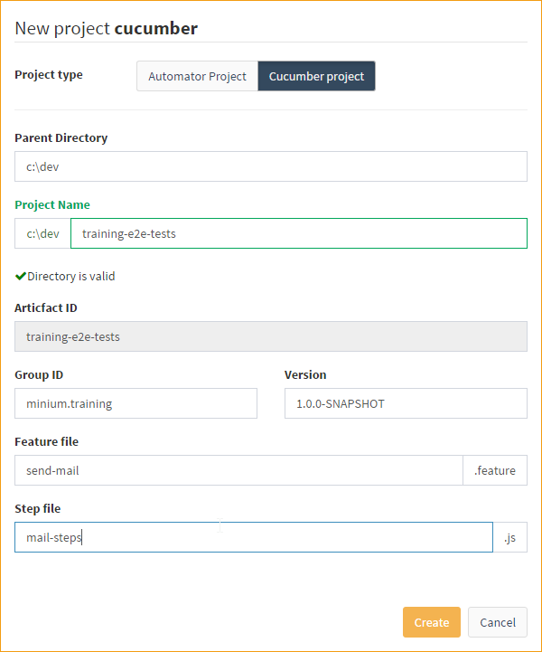
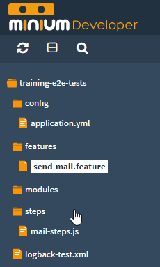
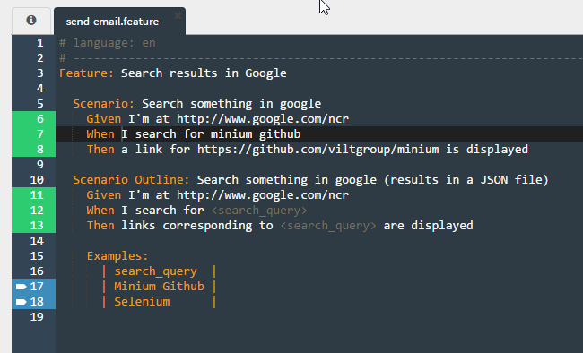
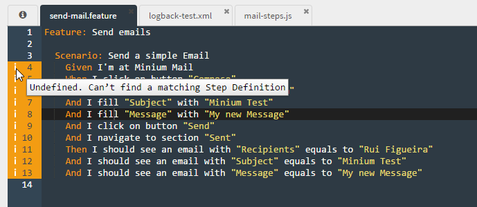
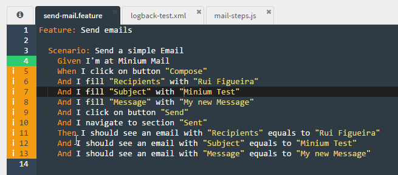
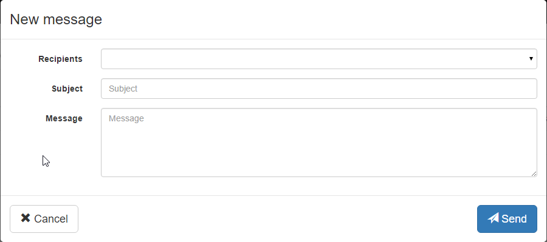

# Cucumber Training

In this section we will try to walk you through on how to create a new
end-to-end testing project using a real-world example.

We'll be using Minium Mail, a sample app that was [adapted from the folks of
flightjs](https://github.com/flightjs/example-app). The application is available
at [http://minium.vilt.io/sample-app/](http://minium.vilt.io/sample-app/).

If you just want to jump straight to the finished test project you can check the
complete source code in
[https://github.com/viltgroup/minium-mail-e2e-tests](https://github.com/viltgroup/minium-mail-e2e-tests)

## Create a Minium Cucumber project

First of all, let's create a Minium Cucumber project:

- Launch Minium Developer
- Click on `Project > Create Project`
- Set the following values

| Field | Value |
| ----- | ----- |
| Project type | Cucumber project |
| Parent Directory | some existing directory, e.g. `c:\dev` |
| Project Name | `training-e2e-tests` |
| Group ID | `minium.training` |
| Version | `1.0.0-SNAPSHOT` |
| Feature file | `send-mail` |
| Step file | `mail-steps` |



- Click `Create`
- Minium Developer will refresh and opened the project you just created:



- That project will contain some example code which you can run by opening
  `features/send-email.feature` and press `Run All`. If no WebDriver is open,
  just pick one. You'll see its progress in the editor.



## Writing the first Scenario

As you already know a **scenario** is part of a **feature**, and the
**scenario** itself is made of **steps**.

To illustrate the use of Minium and Cucumber we will create a user story that
tests the functionality of sending emails. The first **scenario** that we will
create is to send an email and verify if the email was really sent.

For that, we will need to:

1. Go to the Minium Mail page
2. Click on `Compose` button
3. Fill the new email form
4. Click on `Send` button
5. Go to Sent section
6. Verify is the email exists

Let's convert those actions into a scenario. For that, just replace all the
content of `feature/send-mail.feature` with the following:

```gherkin
Feature: Send emails

  Scenario: Send a simple Email
    Given I'm at Minium Mail
    When I click on button "Compose"
    And I fill "Recipients" with "Rui Figueira"
    And I fill "Subject" with "Minium Test"
    And I fill "Message" with "My new Message"
    And I click on button "Send"
    And I navigate to section "Sent"
    Then I should see an email with "Recipients" equals to "Rui Figueira"
    And I should see an email with "Subject" equals to "Minium Test"
    And I should see an email with "Message" equals to "My new Message"
```

Also, clear all code in `steps/mail-steps.js`, because it no longer makes sense
for these scenarios.

You can now try to run it by placing the cursor in any line of that scenario and
press `Ctrl + Enter` or clicking `Run`:



You'll notice that no step will actually run, because they have no
implementation yet and are, for that reason, undefined.

## Step definitions

The following **step** must ensure the browser is at our Minium Mail sample app:

```gherkin
Given I'm at Minium Mail
```

This **step** needs a **step definition** to translate plain text into actions
that will interact with the system.

To create a **step definition** for that **step**, edit `steps/mail-steps.js`
and add the following code there:

```javascript
When(/^I'm at Minium Mail$/, function() {
  browser.get("http://minium.vilt.io/sample-app/");
});
```

That code will instruct Minium cucumber to call that function every time the
correspondent regular expression matches a step.

You can now run the scenario again and you'll notice the WebDriver browser will
open the page properly, and that the step `Given I'm at Minium Mail` will be
marked as `green`:



**Exercise:**

Try to implement a step definition for the following step:
```gherkin
When I click on button "Compose"
```

For it to be generic enough, we'll capture the button text in the step using
a regular expression:

```javascript
When(/^I click on button "(.*?)"$/, function(btnLabel) {
  // your code goes here
});
```

Then, run the scenario again to ensure it is working properly.

## Fill a form

Now we want to fill the new email form. The steps used to fill the form are the
following:

```gherkin
When I fill "Recipients" with "Rui Figueira"
And I fill "Subject" with "Minium Test"
And I fill "Message" with "My new Message"
```

In the figure below we can see the form that we want to fill:



In the step definition, we need to get all the elements of the form (stored in
variable inputs). Since we can have different types of elements in a form (e.g.
textbox, radio, button, checkbox, option, etc) we need to check the type of
the input before we actually fill the form.

```javascript
When(/^I fill "(.*?)" with "(.*?)"$/, function(fldName, value) {
  // get all elements of the form
  var flds = $("input, textarea, select");

  // find the element by its label
  var fld = flds.withLabel(fldName);

  // check the type of the element
  if (fld.waitForExistence().is("select")) {
    // if the element is a select box
    fld.select(value);
  } else {
    // if the element is a textbox
    fld.fill(value);
  }
});
```

Try to run the scenario. You'll notice the form was filled, and the `Send`
button was pressed because the same step definition responsible for clicking the
`Compose` button was triggered.

**Exercise:**

Implement the `And I navigate to section "Sent"` step. You'll need to consider
the fact that, after pressing the `Send` button, the modal backdrop will still
be there and so you will need to wait for it to fade out and disappear. You'll
get extra points if you use the base expression pattern.

## Assertions

Now we want to validate if the email that we send was actually sent. For that
we will navigate to the section "Sent" and validate the data.

The steps used to validate if the email was sent are the following:

```gherkin
Then I should see an email with "Recipients" equals to "Rui Figueira"
And I should see an email with "Subject" equals to "Minium Test"
And I should see an email with "Message" equals to "My new Message"
```

The steps above will match the step definition below:

```javascript
Then(/^I should see an email with "(.*?)" equals to "(.*?)"$/, function(field, value) {
	//find the rows of the table
  var headers = $("#mail-list th");
  var cells = $("#mail-list td");

  var header = headers.withText(field);
  var cell = cells.below(header).withText(value);

	//do the assertion
	expect(cell).to.have.size(1);
});
```

Add it to `steps/mail-steps.js` and run the scenario once again. It should now
complete successfully.

## Refactoring

### Configuration values

In `config/application.yml` under your project, you can find all your Minium
configuration (for instance, which default browser to use, browser window
dimensions, etc.).

There is, however, a special configuration block under `minium.config`: that
is configuration you can add and use in your application. In your javascript
code, you can access all its properties under the variable `config`.

**Exercise:**

Edit the `application.yml` and change it to have a property `baseUrl` with the
URL of Minium Mail sample app:

```yaml
minium:
  webdriver:
   ...
   config:
     baseUrl: http://minium.vilt.io/sample-app/
```

That `baseUrl` property is now under the variable `config`, so you can evaluate
the following code in the javascript console:

```javascript
config.baseUrl // it evaluate into "http://minium.vilt.io/sample-app/"
```

You can even add complex configuration there:

```yaml
minium:
  webdriver:
   ...
  config:
    baseUrl: http://minium.vilt.io/sample-app/
    users:
      administrator:
        username: admin
        password: strong_password
    fruits:
      - banana
      - orange
      - strawberry
```

We can now refactor our first step definition to use `config.baseUrl` instead of
the hardcoded value:

```javascript
When(/^I'm at Minium Mail$/, function() {
  browser.get(config.baseUrl);
});
```

### Data tables

We can refactor our feature file using tables. Tables are useful for specifying
a larger data set and are more readable.

```gherkin
Scenario: Send an Email

  Given I'm at Minium Mail
  When I click on button "Compose"
  And I fill:
    | Recipients | Rui Figueira   |
    | Subject    | Minium Test    |
    | Message    | My new Message |
  And I click on button "Send"
  And I navigate to section "Sent"
  Then I should see an email with:
    | Recipients | Rui Figueira   |
    | Subject    | Minium Test    |
    | Message    | My new Message |
```

When we are using tables, the step definition needs to be changed. For the
following steps using tables:

```gherkin
When I fill:
  | Recipients | Rui Figueira   |
  | Subject    | Minium Test    |
  | Message    | My new Message |
```

The step definition is now receiving a datatable as argument with the
information of table. What we need to do is iterate over the elements if the
table and fill the form with them.

```javascript
When(/^I fill:$/, function(datatable) {
  var flds = $("input, textarea, select");

  // get the values of the datatable creating an object like:
  // {
  //   "Contact": "Rui Figueira",
  //   "Subject": "Minium Test",
  //   "Message": "My new Message"
  // }
  var values = datatable.rowsHash();

  // iterate over the elements of the datatable
  for (var fldName in values) {
    var fld = flds.withLabel(fldName);
    var val = values[fldName];

    if (fld.is("select")) {
      fld.select(val);
    } else {
      fld.fill(val);
    }
  }
});
```

### Interaction listeners and Base expressions

Global browser configuration like
[interaction listeners](minium-core-js.md#interaction-listeners) and
[base expressions](minium-core-js.md#base-expression-pattern)
can also be used in Minium Cucumber projects. For that, we recommend that the
corresponding code goes into a `steps/world.js` file that makes use of a
Cucumber function, `World`, which receives two callbacks: the first one is
invoked when a scenario starts to run, and the second when it completes. As a
good practice, base expressions and interaction listeners should be defined and
registered inside the first callback, and then removed in the second callback:

```javascript
var timeUnits = require("minium/timeunits");

var base;
var loadingUnexistenceListener;

World(function () {

  var loading = $(".loading").withCss("display", "block");

  // base expression
  base = $(":root").unless(".modal-backdrop").add(".modal-dialog");

  // we keep a variable for our interaction listener so that we can remove it
  // at the end of the execution
  loadingUnexistenceListener = minium.interactionListeners
    .ensureUnexistence(loading)
    .withWaitingPreset("slow");

  // browser configuration
  browser.configure()
    .waitingPreset("fast")
      .timeout(1, timeUnits.SECONDS)
    .done()
    .waitingPreset("slow")
      .timeout(10, timeUnits.SECONDS)
    .done()
    .interactionListeners()
      .add(loadingUnexistenceListener)
    .done();

}, function () {
  // we need to remove our interaction listeners at the end so that in the next
  // scenario we don't end up having two identical interaction listeners
  browser.configure()
    .interactionListeners()
      .remove(loadingUnexistenceListener)
    .done();

  base = undefined;
});
```

Now, you can replace all `$(...)` calls with `base.find(...)` in any of your
javascript files, and also remove any `waitForUnexistence` you have related with
the spinning wheel and modal backdrop.

### Modules

With Minium you can also create modules, in order to help you keeping your code
clean, organized and reusable. A module is a standard object literal containing
methods and properties.

For this example we can create a module to fill the form of the email. Create a
new file `modules/forms.js` and paste the following code there:

```javascript
var forms = {

  fill : function (vals) {
    for (var fldName in vals) {
      var value = vals[fldName];

      var fld = base.find("input, textarea, select").withLabel(fldName);

      if (fld.waitForExistence().is("select")) {
        fld.select(value);
      } else {
        fld.fill(value);
      }
    }
  },

  submit : function () {
    var btn = base.find("submit");

    btn.click();
  }
};

if (typeof module !== 'undefined') module.exports = forms;
```

After creating your module you can simply call it this way:

```javascript
var forms = require("forms"); // or require("forms.js")

//  start composing an email
$("#compose").click();

forms.fill({ "Recipients": "Minium Bot" });
forms.submit();
```

So in your **step definition**, you can now use the module.

```javascript

//require the form module
var forms = require("forms");

When(/^I fill:$/, function(datatable) {
  var values = datatable.rowsHash();

  //use the function of the module
  forms.fill(values);
});
```

### Background

Sometimes you will find yourself repeating the same `Given` steps in all of the
scenarios in a feature.

You can move and group those steps under a Background section before the fisrt
scenario. The background runs before each one of your scenarios.

```gherkin
Feature: Delete Emails

  Background:
    Given I'm at Minium Mail

  Scenario: Delete an email
    Given an email with Subject "Minium Can!" exists
    When I delete an email with Subject "Minium Can!"
    And I navigate to section "Trash"
    Then I should see an email with:
      | Subject | Minium Can! |

  Scenario: Delete an email from trash
    Given I'm at section "Trash"
    And an email with Subject "Phasellus vitae interdum nulla." exists
    When I delete an email with Subject "Phasellus vitae interdum nulla."
    Then I shouldn't see an email with:
      | Subject | Minium Can! |
```

### Scenario Outlines

In the follwoing scenarios, the steps are the same, only the data changes.

```gherkin
Scenario: Send an Email
    When I click on button "Compose"
    And I fill:
      | Recipients | Rui Figueira   |
      | Subject    | Minium Test    |
      | Message    | My new Message |
    And I click on button "Send"
    And I navigate to section "Sent"
    Then I should see an email with:
      | Recipients | Rui Figueira   |
      | Subject    | Minium Test    |
      | Message    | My new Message |

Scenario: Send an Email
    When I click on button "Compose"
    And I fill:
      | Recipients | Mario Lameiras                                         |
      | Subject    | BDD + Minium                                           |
      | Message    | Egestas morbi at. Curabitur aliquet et commodo nonummy |
    And I click on button "Send"
    And I navigate to section "Sent"
    Then I should see an email with:
      | Recipients | Mario Lameiras                                  |
      | Subject    | BDD + Minium                                    |
      | Message    | Egestas morbi at. Curabitur aliquet et commodo  |
```
We can refactor this scenarios using Scenario outlines. Scenario outlines allow
us to write more concisely Scenarios through the use of a template with
placeholders, using `Examples` with tables and `< >` delimited parameters. The
following `Scenario` is the same as the one above.

```gherkin
Scenario Outline: Send simple emails
  When I click on button "Compose"
  And I fill:
    | Recipients | <to>      |
    | Subject    | <subject> |
    | Message    | <message> |
  And I click on button "Send"
  And I navigate to section "Sent"
  Then I should see an email with:
    | Recipients | <to>      |
    | Subject    | <subject> |
    | Message    | <message> |

  Examples:
    | to             | subject      | message                                        |
    | Rui Figueira   | Minium Test  | My New messages                                |
    | Mario Lameiras | BDD + Minium | Egestas morbi at. Curabitur aliquet et commodo |
```

## Autocomplete

If you want to have some help writing your steps, you can add in your
`config/application.yml` of your cucumber project the step's that you are
writing. This way you will have auto-completion features for those step's.

```yaml
minium:
  webdriver:
   ...
  cucumber:
    snippets:
      - name: "Given I'm at Minium Mail"
      - name: "When I click on button \"...\""
      - name: "When I fill \"...\" with \"...\""
      - name: "When I navigate to section \"...\""
      - name: "Then I should see an email with \"...\" equals to \"...\""
```

---

You can check the complete source code in [https://github.com/viltgroup/minium-mail-e2e-tests](https://github.com/viltgroup/minium-mail-e2e-tests)
